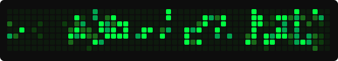

<div align="center">


<br/>

[](https://git.io/typing-svg)

</div>

<br/>

```
╔═══════════════════════════════════════════════════════════════════╗
║  ID       :  Joshuaisikah  //  神風  //  Kamikaze                ║
║  専門分野  :  Systems · Blockchain · ML · Cybersecurity           ║
║  状態     :  Grinding IoT · Dynamic Programming · Rust APIs      ║
║  所在地   :  ネオ東京 // The Matrix                               ║
╚═══════════════════════════════════════════════════════════════════╝
```

<br/>

<div align="center">

Systems developer primarily writing **Rust**, with strong roots in **C++** and **C#**.
Exploring **IoT & firmware** and grinding dynamic programming challenges.
Taming **Graph Attention Networks** by day — hunting vulnerabilities on **Kali Linux** by night.

</div>

---

<div align="center">

## `⚡ TECH STACK`

<!-- LANGUAGES -->


<table>
  <tr>
    <td align="center" width="90"><br/><sub><b>Rust</b></sub></td>
    <td align="center" width="90"><br/><sub><b>Python</b></sub></td>
    <td align="center" width="90"><br/><sub><b>TypeScript</b></sub></td>
    <td align="center" width="90"><br/><sub><b>JavaScript</b></sub></td>
    <td align="center" width="90"><br/><sub><b>Java</b></sub></td>
    <td align="center" width="90"><br/><sub><b>PHP</b></sub></td>
    <td align="center" width="90"><br/><sub><b>C#</b></sub></td>
    <td align="center" width="90"><br/><sub><b>C++</b></sub></td>
    <td align="center" width="90"><br/><sub><b>C</b></sub></td>
  </tr>
</table>

<br/>

<!-- ML & AI -->


<table>
  <tr>
    <td align="center" width="90"><br/><sub><b>TensorFlow</b></sub></td>
    <td align="center" width="90"><br/><sub><b>PyTorch</b></sub></td>
    <td align="center" width="110"><br/><sub><b>scikit-learn</b></sub></td>
    <td align="center" width="90"><br/><sub><b>Pandas</b></sub></td>
    <td align="center" width="90"><br/><sub><b>NumPy</b></sub></td>
    <td align="center" width="90"><br/><sub><b>Graph Attention</b></sub></td>
  </tr>
</table>

<br/>

<!-- WEB BACKEND -->


<table>
  <tr>
    <td align="center" width="90"><br/><sub><b>Laravel</b></sub></td>
    <td align="center" width="90"><br/><sub><b>.NET</b></sub></td>
    <td align="center" width="90"><br/><sub><b>GraphQL</b></sub></td>
    <td align="center" width="100"><br/><sub><b>Actix Web</b></sub></td>
  </tr>
</table>

<br/>

<!-- BLOCKCHAIN -->


<table>
  <tr>
    <td align="center" width="130"><br/><sub><b>Solana</b></sub></td>
    <td align="center" width="130"><br/><sub><b>Substrate</b></sub></td>
    <td align="center" width="130"><br/><sub><b>Anchor</b></sub></td>
    <td align="center" width="130"><br/><sub><b>NEAR Protocol</b></sub></td>
  </tr>
</table>

<br/>

<!-- DEVOPS -->


<table>
  <tr>
    <td align="center" width="90"><br/><sub><b>Docker</b></sub></td>
    <td align="center" width="90"><br/><sub><b>Kubernetes</b></sub></td>
    <td align="center" width="90"><br/><sub><b>GH Actions</b></sub></td>
    <td align="center" width="90"><br/><sub><b>Nginx</b></sub></td>
  </tr>
</table>

<br/>

<!-- FRONTEND -->


<table>
  <tr>
    <td align="center" width="90"><br/><sub><b>React</b></sub></td>
    <td align="center" width="90"><br/><sub><b>Tailwind</b></sub></td>
    <td align="center" width="90"><br/><sub><b>HTML5</b></sub></td>
    <td align="center" width="90"><br/><sub><b>CSS3</b></sub></td>
    <td align="center" width="90"><br/><sub><b>Vite</b></sub></td>
  </tr>
</table>

<br/>

<!-- DATABASES -->


<table>
  <tr>
    <td align="center" width="90"><br/><sub><b>PostgreSQL</b></sub></td>
    <td align="center" width="90"><br/><sub><b>MySQL</b></sub></td>
    <td align="center" width="90"><br/><sub><b>MongoDB</b></sub></td>
    <td align="center" width="90"><br/><sub><b>SQLite</b></sub></td>
    <td align="center" width="90"><br/><sub><b>MariaDB</b></sub></td>
  </tr>
</table>

<br/>

<!-- OS -->


<table>
  <tr>
    <td align="center" width="90"><br/><sub><b>Linux</b></sub></td>
    <td align="center" width="90"><br/><sub><b>Arch</b></sub></td>
    <td align="center" width="90"><br/><sub><b>Kali Linux</b></sub></td>
    <td align="center" width="90"><br/><sub><b>Ubuntu</b></sub></td>
    <td align="center" width="90"><br/><sub><b>Fedora</b></sub></td>
    <td align="center" width="90"><br/><sub><b>Manjaro</b></sub></td>
    <td align="center" width="90"><br/><sub><b>Windows 11</b></sub></td>
  </tr>
</table>

<br/>

<!-- TOOLS -->


<table>
  <tr>
    <td align="center" width="90"><br/><sub><b>Git</b></sub></td>
    <td align="center" width="90"><br/><sub><b>GitHub</b></sub></td>
    <td align="center" width="90"><br/><sub><b>VS Code</b></sub></td>
    <td align="center" width="90"><br/><sub><b>Apache</b></sub></td>
    <td align="center" width="90"><br/><sub><b>Cisco</b></sub></td>
    <td align="center" width="90"><br/><sub><b>NPM</b></sub></td>
  </tr>
</table>

</div>

---

## `トロフィー // TROPHIES`

<div align="center">


</div>

---

## `統計 // STATS`

<div align="center">


<br/>


</div>

---

## `活動 // CONTRIBUTION ACTIVITY`

<div align="center">


</div>

---

## `蛇 // CONTRIBUTION SNAKE`

<div align="center">



</div>

---

<div align="center">

```
> Wake up, Neo...        起きてください、ネオ...
> The Matrix has you...  マトリックスはあなたを捕まえている...
> Follow the white rabbit. 白いウサギを追え。 🐇
> There is no spoon.     スプーンは存在しない。
```

[](https://git.io/typing-svg)

<br/>


[](https://visitcount.itsvg.in)

</div>
